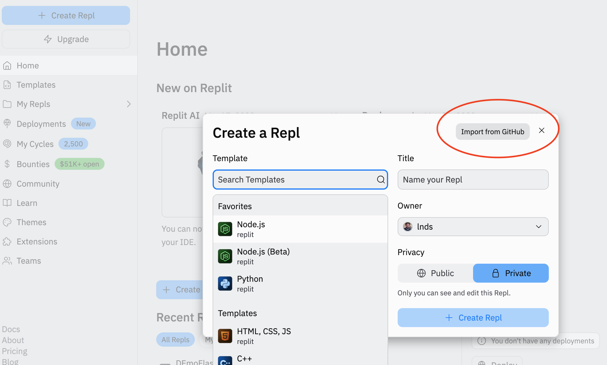

# Tarea 1

## Preparación

1. Haz un fork de este repo en tu propia cuenta en GitHub.
2. Clonz el fork en ReplIt, usando el botón `Import from Github`, tal como se muestra en la imagen:


 

## Paso 1 

Crea una rama llamada `crear-libros`, y luego cámbiate a esta:

```
git checkout -b crear-libros
git switch crear-libros
```

Modifica el archivo `main.py` en la línea 3 dejándola así:

```python
from flask import Flask, render_template, request, url_for, redirect

```

Luego agrega la siguiente ruta al final del archivo `main.py`, antes de las línea con el comentario `# run the server`

```python
@app.route('/create/', methods=('GET', 'POST'))
def create():
    return render_template('create.html')


# run the server 
```


Agrega el cambio al área stage de git con el siguiente comando en la shell de Replit:

```
git add main.py
```

# Paso 2

En la carpeta templates agrega el archivo `create.html` y agrega el siguiente código en este:

```html



    <h1> Add a New Book </h1>
    <form method="post">
        <p>
            <label for="title">Title</label>
            <input type="text" name="title"
                   placeholder="Book title">
            </input>
        </p>

        <p>
            <label for="author">Author</label>
            <input type="text" name="author"
                   placeholder="Book author">
            </input>
        </p>

        <p>
            <label for="pages_num">Number of pages</label>
            <input type="number" name="pages_num"
                   placeholder="Number of pages">
            </input>
        </p>
        <p>
        <label for="review">Review</label>
        <br>
        <textarea name="review"
                  placeholder="Review"
                  rows="15"
                  cols="60"
                  ></textarea>
        </p>
        <p>
            <button type="submit">Submit</button>
        </p>
    </form>

```

Agrega la carpeta templates al stage:  

```
git add templates
```


Ahora haz un commit de la siguiente forma:

```
git commit -m "feat: agrega el endpoint create"
```

Luego de esto revia que los cambios se reflejan ejecutando el programa, y navegando a la url `/create` en el browser (webview) de ReplIt.

# Paso 3

Modifica la función `create` en el archivo `main.py` dejándola así:

```python
@app.route('/create/', methods=('GET', 'POST'))
def create():
    if request.method == 'POST':
        title = request.form['title']
        author = request.form['author']
        pages_num = int(request.form['pages_num'])
        review = request.form['review']

        conn = get_db_connection()
        cur = conn.cursor()
        cur.execute('INSERT INTO books (title, author, pages_num, review)'
                    'VALUES (%s, %s, %s, %s)',
                    (title, author, pages_num, review))
        conn.commit()
        cur.close()
        conn.close()
        return redirect(url_for('index'))

    return render_template('create.html')
```

Prueba que estos cambios funcionan agregándo nuevos libros.

Haz un commit con este cambio con el mensaje `"feat: implementa inserción de libros en la base de datos"`.

# Paso 4

Respalda tu rama en tu fork con este comando:

```
git push origin crear-libros
```

Cambiate a la rama main e integra los cambios de la rama `crear-libros`:

```
git switch main
git rebase crear-libros
```

# Paso 5

Ejecuta este comando:

```
git log --pretty=format:" - %h %an %as: %s"
```

De la salida de ese comando selecciona las entradas que corresponden a los commits que has realizado hasta este momento.

Agrega esas líneas seleccionada en el archivo `CHANGELOG.md` debajo de la linea que dice `## [Unreleased]` (asegurate de dejar una linea en blanco antes y después de las lineas que hayas ingresado).

Haz un commit incluyendo el archivo `CHANGELOG.md` y luego haz un push a tu fork.

# Paso 6  

Agrega un archivo que se llame `RESPUESTAS.md` y anota allí las siguientes preguntas con sus respuestas:


- ¿Si ejecutas el comand `git blame main.py` qué ocurre?
- Explica cómo funciona el comando log del paso 5
- ¿Cuántas veces modificó el archivo `README.md` el profesor? ¿Cómo determinaste ese número?
- Anota los nombres de los integrantes del grupo que realizó la tarea

Recuerda hacer un commit para el archivo `RESPUESTAS.md` y su respectivo push.

# Entrega

Envía un pull request a este repositorio para entregar tu tarea.
